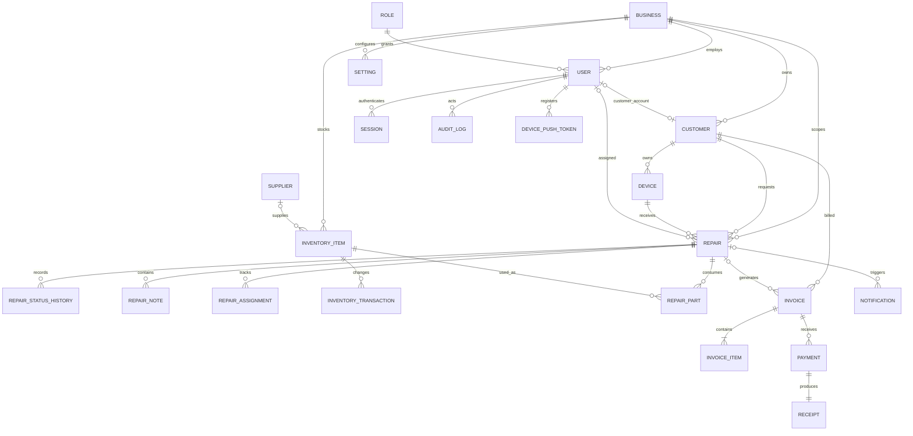

# Database design

RepairTrack uses PostgreSQL through Prisma. The schema is normalized to at least third normal form: reusable entities have separate tables, many-to-many/history relationships use link tables, and derived financial totals are transactionally maintained snapshots rather than duplicated free-form records.

The authoritative sources are `backend/prisma/schema.prisma` and `backend/prisma/migrations/20260811190000_initial/migration.sql`.

## Core ERD



## Tables

The initial migration creates 26 tables: `businesses`, `roles`, `users`, `customers`, `devices`, `repairs`, `repair_status_history`, `repair_notes`, `repair_assignments`, `suppliers`, `inventory_items`, `inventory_transactions`, `repair_parts`, `invoices`, `invoice_items`, `payments`, `receipts`, `notifications`, `audit_logs`, `sessions`, `password_resets`, `email_verifications`, `settings`, `setup_locks`, `sequence_counters`, and `device_push_tokens`.

## Integrity rules

- UUID primary keys prevent predictable internal identifiers.
- Tenant records carry indexed `businessId` foreign keys.
- Customer email/phone, device serial/IMEI, document number, SKU, and setting uniqueness are constrained in the appropriate tenant scope.
- Foreign keys preserve ownership; delete behavior is explicit. Business data normally uses `deletedAt` soft deletion.
- Decimal database types represent money; application calculations reject negative amounts, overpayments, and invalid discounts.
- Serializable transactions allocate human-readable references and document numbers without race duplicates.
- Stock consumption, repair-part creation, invoice payment/balance updates, receipt creation, and audit writes commit together.
- Public tracking, reset, verification, and refresh secrets are stored only as hashes.
- Indexes cover tenant/status/date, repair reference, contact lookup, serial/IMEI, invoice/receipt number, SKU/barcode, technician assignments, and audit ordering.

## Migration workflow

Development schema change:

```bash
pnpm --filter @repairtrack/backend prisma:migrate:dev -- --name descriptive_change
pnpm --filter @repairtrack/backend prisma:generate
```

Production deploy:

```bash
pnpm --filter @repairtrack/backend prisma:migrate
```

Never use `prisma db push` against production. Commit each generated migration and review destructive statements.

## Fresh-install verification

With an empty PostgreSQL database:

```bash
pnpm --filter @repairtrack/backend prisma:validate
pnpm --filter @repairtrack/backend prisma:migrate
pnpm --filter @repairtrack/backend prisma:migrate
```

The second deploy must be a no-op. Then check `/ready`, verify all foreign keys, and confirm `users`, `businesses`, and `setup_locks` are empty before the setup CLI. No migration contains demo accounts.

## Backup and retention

Use encrypted daily backups and point-in-time recovery in production. Test restoration quarterly into an isolated environment. Restrict backup access, record restore drills, and delete expired backup sets according to [privacy and retention](privacy-retention.md).
